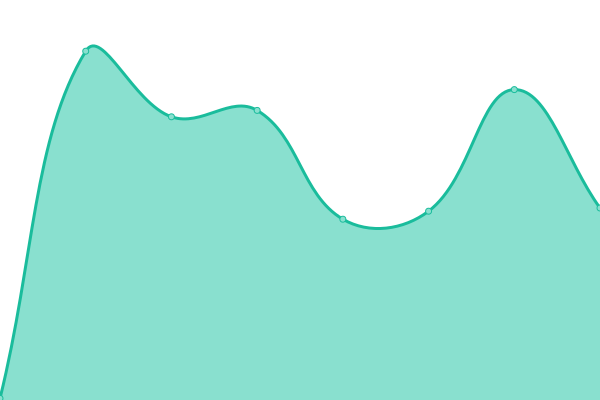

# [📈 Live Status](https://demo.upptime.js.org): <!--live status--> **🟥 Complete outage**

This repository contains the open-source uptime monitor and status page for [Kristopher Burney](https://demo.upptime.js.org), powered by [Upptime](https://github.com/upptime/upptime).

With [Upptime](https://upptime.js.org), you can get your own unlimited and free uptime monitor and status page, powered entirely by a GitHub repository. We use [Issues](https://github.com/burneykb/upptime/issues) as incident reports, [Actions](https://github.com/burneykb/upptime/actions) as uptime monitors, and [Pages](https://demo.upptime.js.org) for the status page.

<!--start: status pages-->
<!-- This summary is generated by Upptime (https://github.com/upptime/upptime) -->
<!-- Do not edit this manually, your changes will be overwritten -->
<!-- prettier-ignore -->
| URL | Status | History | Response Time | Uptime |
| --- | ------ | ------- | ------------- | ------ |
|  [Authelia](https://auth.burneykb.com) | 🟥 Down | [authelia.yml](https://github.com/burneykb/upptime/commits/HEAD/history/authelia.yml) | 

 179ms
     
 | 

<a href="https://burneykb.github.io/upptime/history/authelia">46.87%</a>
    

|  [Vaultwarden](https://vaultwarden.burneykb.com) | 🟥 Down | [vaultwarden.yml](https://github.com/burneykb/upptime/commits/HEAD/history/vaultwarden.yml) | 

 183ms
     
 | 

<a href="https://burneykb.github.io/upptime/history/vaultwarden">46.88%</a>
    

|  [Plex](https://plex.burneykb.com) | 🟥 Down | [plex.yml](https://github.com/burneykb/upptime/commits/HEAD/history/plex.yml) | 

 179ms
     
 | 

<a href="https://burneykb.github.io/upptime/history/plex">46.88%</a>
    

|  [404 Landing Page](https://thissitedoesntexist.burneykb.com) | 🟥 Down | [404-landing-page.yml](https://github.com/burneykb/upptime/commits/HEAD/history/404-landing-page.yml) | 

 152ms
     
 | 

<a href="https://burneykb.github.io/upptime/history/404-landing-page">46.89%</a>
    

|  [Immich](https://photos.burneykb.com) | 🟥 Down | [immich.yml](https://github.com/burneykb/upptime/commits/HEAD/history/immich.yml) | 

 182ms
     
 | 

<a href="https://burneykb.github.io/upptime/history/immich">46.89%</a>
    

|  [Fantasy](https://fantasy.burneykb.com) | 🟥 Down | [fantasy.yml](https://github.com/burneykb/upptime/commits/HEAD/history/fantasy.yml) | 

 193ms
     
 | 

<a href="https://burneykb.github.io/upptime/history/fantasy">46.90%</a>
    

<!--end: status pages-->

[**Visit our status website →**](https://demo.upptime.js.org)

## 📄 License

- Powered by: [Upptime](https://github.com/upptime/upptime)
- Code: [MIT](./LICENSE) © [Anand Chowdhary](https://anandchowdhary.com), supported by [Pabio](https://pabio.com)
- Data in the `./history` directory: [Open Database License](https://opendatacommons.org/licenses/odbl/1-0/)
